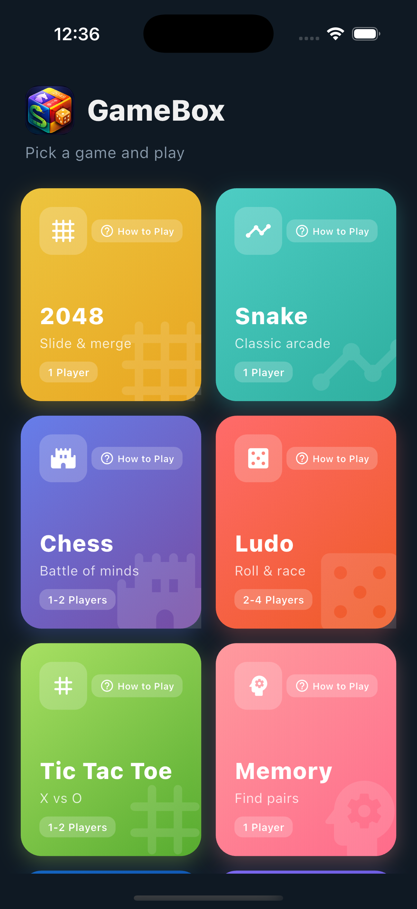
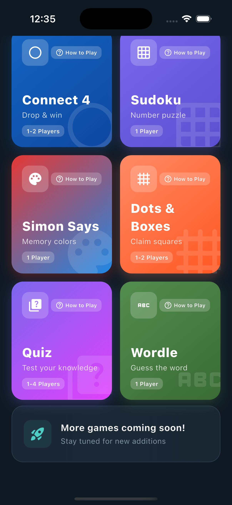

# Quirkade

A collection of 13 classic games built with Flutter. Available on iOS and Android.

## Screenshots

<p align="center">
  
  
</p>

## Games

| Game | Players | Features |
|------|---------|----------|
| 2048 | 1 | 6 visual themes, persistent high score |
| Snake | 1 | Special foods (fake, rock/real, timed), D-pad controls, gradual speed |
| Chess | 1-2 | 3 AI levels (Easy/Medium/Hard), 3 piece styles, 5 board themes, WiFi multiplayer |
| Ludo | 2-4 | Color picker, capture bonus turns, stacked piece indicators |
| Tic Tac Toe | 1-2 | AI opponent, WiFi multiplayer |
| Memory Match | 1 | Card flip animations |
| Four in a Row | 1-2 | Smart AI (minimax depth 5), WiFi multiplayer |
| Sudoku | 1 | Multiple difficulty levels |
| Color Recall | 1 | Persistent best score |
| Dots & Boxes | 1-2 | 7x7 grid, AI opponent, WiFi multiplayer |
| Quiz | 1-4 | 9 categories, 400+ questions, pass-and-play multiplayer |
| Five Letters | 1 | 750+ words, stats tracking, win streaks |
| Falling Blocks | 1 | Line-clearing block puzzle |
| Maze Munch | 1 | Maze chase game |
| Stack | 1 | Timing-based stacking game |
| Guess It! | 2+ | Team clue-guessing game |

## WiFi Multiplayer

Chess, Tic Tac Toe, Four in a Row, and Dots & Boxes support WiFi multiplayer — play against friends on the same network with zero cloud cost. One player hosts, others join with a room code.

## Tech Stack

- **Framework:** Flutter (Dart)
- **State:** StatefulWidget + shared_preferences for persistence
- **Networking:** TCP sockets for WiFi multiplayer (no server needed)
- **Platforms:** iOS 13+, Android 5.0+

## Project Structure

```
lib/
├── main.dart                          # App entry point
├── firebase_options.dart              # (unused, can remove)
│
├── core/
│   ├── theme/
│   │   └── game_theme.dart            # Shared dark theme colors & styles
│   ├── utils/
│   │   └── game_help.dart             # How to Play instructions for all games
│   ├── services/
│   │   └── wifi_game_service.dart     # TCP socket service for WiFi multiplayer
│   └── widgets/
│       └── wifi_lobby.dart            # Reusable host/join lobby widget
│
├── features/
│   ├── home/ui/home_screen.dart       # Game grid with cards
│   ├── game_2048/ui/                  # 2048 with themes
│   ├── snake/ui/                      # Snake with special foods
│   ├── chess/ui/                      # Chess with AI levels
│   ├── ludo/ui/                       # Ludo with color picker
│   ├── tictactoe/ui/                  # Tic Tac Toe
│   ├── memory/ui/                     # Memory Match
│   ├── connect4/ui/                   # Four in a Row with minimax AI
│   ├── sudoku/ui/                     # Sudoku
│   ├── simon/ui/                      # Color Recall
│   ├── dots_boxes/ui/                 # Dots & Boxes
│   ├── quiz/
│   │   ├── data/quiz_questions.dart   # 400+ questions across 9 categories
│   │   └── ui/quiz_screen.dart        # Quiz game UI
│   └── wordle/
│       ├── data/word_list.dart        # 750+ five-letter words
│       └── ui/wordle_screen.dart      # Five Letters game UI
│
assets/
├── app_icon.png                       # App icon source
├── play_store_icon_512.png            # Google Play icon
├── play_store_feature_graphic.png     # Google Play feature graphic
└── screenshot_*.png                   # Store screenshots
```

## Building

### Prerequisites
- Flutter SDK (3.9+)
- Xcode (for iOS)
- Android Studio (for Android)

### Run locally
```bash
flutter pub get
flutter run
```

### Build for release

**iOS (App Store):**
```bash
flutter build ipa --release
# Upload via Xcode Organizer: open build/ios/archive/Runner.xcarchive
```

**Android (Google Play):**
```bash
flutter build appbundle --release
# AAB at: build/app/outputs/bundle/release/app-release.aab
```

## Distribution

- **Display name:** Quirkade
- **Publisher:** Buzzz Creations LLC
- **Required individual contact:** Sowmyalakshmi Pavani
- **Android:** Google Play — new LLC-owned listing
- **iOS:** App Store — new LLC-owned listing
- **Application / bundle ID:** com.buzzzcreations.quirkade

## Privacy Policy

The policy in `privacy-policy.html` must be published at a stable public URL and updated with the selected advertising provider's actual data practices before ads are enabled.

## Advertising

Quirkade uses optional rewarded video only. No banner, interstitial, or app-open ads are implemented. Debug builds use Google's test IDs. Before release, replace both native test app IDs and provide the production rewarded unit IDs using `ADMOB_ANDROID_REWARDED_ID` and `ADMOB_IOS_REWARDED_ID` Dart defines.
